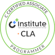
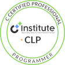
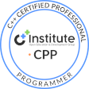
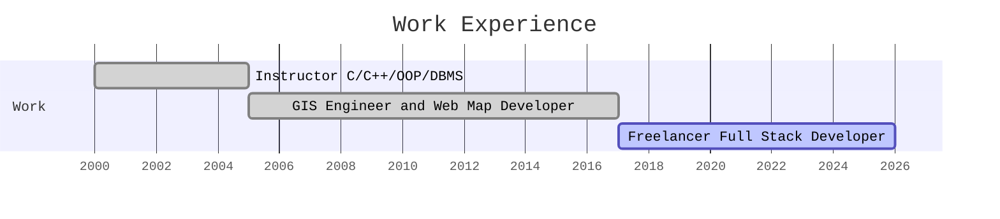

	

<h2 align="center"><a href="https://essamatefelsherif.github.io/whoami/" traget="_blank" title="Essam A. El-Sherif">Essam A. El-Sherif</a></h2>

	

	
	
	
	
		
	
	

	<em>
		This is ME ⋯ <strong>Essam A. El-Sherif</strong> ⋯ an ancient egyptian <strong>Programmer</strong> since the early days of PC's 
		A long journey from <strong>FORTRAN</strong> and <strong>BASIC</strong> under <strong>DOS</strong> up to <strong>Back End Development</strong> under <strong>Linux</strong> 
		Learning while HOPING & HUSTLING!!!
	</em> 

##  [Education]() 

<table>
	<tr></tr>
	<tr>
		<td></td>
		<td>
			<ul>
				<li><a href="https://drive.google.com/file/d/18T6pIXVBTDcDmszMjZdXTO4ecYtlfol-/view?usp=sharing" target="_blank" title="Professional Certificate in Computer Systems and Applications">Professional Certificate in Computer Systems and Applications</a>, 1997 - 1998</li>
				<li><a href="https://www.aucegypt.edu/" target="_blank" title="The American University in Cairo">The American University in Cairo</a>, Egypt</li>
				<li>Algorithms & Data Structures ⋯ Programming ⋯ Operating Systems ⋯ DBMS ⋯ Networking</li>				
			</ul>
		</td>
	</tr>
	<tr></tr>	
	<tr>
		<td></td>
		<td>
			<ul>
				<li><a href="https://drive.google.com/file/d/1onegtIbHrPC5yssy63dOzD2or51M0XDC/view?usp=sharing" target="_blank" title="B.Sc. Degree in Civil Engineering">B.Sc. Degree in Civil Engineering</a>, 1981 - 1986</li>
				<li><a href="https://eng.asu.edu.eg/" target="_blank" title="Faculty of Engineering, Ain Shams University">Faculty of Engineering, Ain Shams University</a>, Cairo, Egypt</li>
				<li>Geomatics Engineering ⋯ Computer Methods in Structural Analysis ⋯ FORTRAN ⋯ Programming</li>			
			</ul>
		</td>
	</tr>
</table>

##  [Certificates]() 

	
	
	
	

	
	
	
	

##  [Skills]() 

  

##  [Experience]() 

##  [Github Stats]() 

	
	

